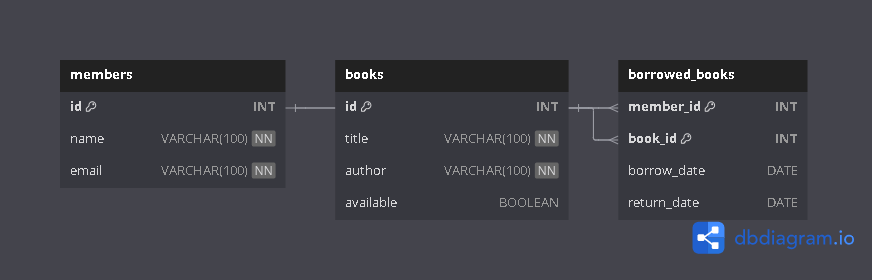

# Library Management System API

## Description
This project allows you to manage a small library system using MySQL and FastAPI to manage library books, authors, and borrowers..

## Project Overview

This project allows users to:
- Add and manage books
- Track borrowers and authors
- Perform Create, Read, Update, and Delete operations via an API

It was built using:
- MySQL (for the database)
- FastAPI (for the backend API)
- VSCode (for development)
- GitHub (for version control)

## Setup Instructions

1. Clone the repo 
```bash
git clone https://github.com/YandaDev/library-management-api.git
cd library-management-api
```
2. Create & activate a virtual environment
```bash
python -m venv venv
source venv/bin/activate  # On Windows: venv\Scripts\activate
```
3. Install dependencies
```bash
pip install -r requirements.txt
```
4. Configure environment variables
Set  your MySQL credentials in the `.env`
```bash
DB_HOST=localhost
DB_USER=root
DB_NAME=library_db
DB_PASSWORD=your_mysql_password
```
5. Import the ddatabase
Open MySQL WOrkbench, then:
- Run the `schema.sql` file to creatte the database and tables

Run the FastAPI server
```bash
 `uvicorn api.main:app --reload`
```

## Endpoints
- GET /members
- POST /members

## ERD



[schema.sql](schema.sql)
